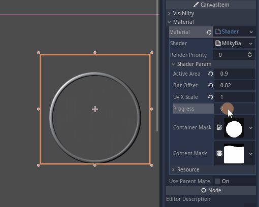

# godot_milkybar

A milky progress bar for Godot Engine.



This is meant to be used in HUDs (*head-up displays*) were any animated vertical bar is expected. Both the shape (container) and the liquid (content) can be anything. It is based on a single Sprite node with a shader controlled by a few parameters and 3 textures.

### Textures

- One `base texture` is used as the actual texture for the liquid. All the color for the content is taken from this texture;

- One `container mask` is used to define the contour of the object (a circle in the given example). Only the red channel is used, and controls the alpha channel of the Sprite. The position is fixed;

- One `content mask` is used to define the shape of the contents (an oscillating liquid in the given example). Only the red channel is used, and controls the alpha channel of the Sprite. Its vertical position is controlled by the `Progress` parameter, moving the mask *down* in the inverse proportion to the progress (that is, `Progress = 1.0` means the mask is not moved, while `Progress = 0.0` means the mask is moved down completely). When the mask is moved down, the upper row of pixels is repeated to cover the rest of the area, so this first row should ideally be black.


### Parameters

The following parameters are implemented:

- **ActiveArea**: if only a percentage of the vertical space is occupied by the bar, and the progress bar must be shrinked to fit, this controls the actual portion occupied by the bar, normalized (e.g. if the Container Mask occupies 50% of the vertical range of the Sprite, make `ActiveArea = 0.5`)

- **BarOffset**: if the bar does not start in the very bottom of the sprite, set this to the normalized percentage of the vertical span where the bar starts, from bottom

- **UV_X_Scale**: scales the content mask (and *only* the content mask!) UV in horizontal direction

- **Progress**: the main control variable, normalized (empty bar at `0.0` and full bar at `1.0`, internally clamped)


### Usage

Configure the Sprite as desired at design time, and change the level at run time by writing the normalized value to the `Progress` shader param:

```
var sprite = get_node("NodePath/To/Your/Sprite")

var desired_value = 0.42

sprite.material.set_shader_param("Progress", desired_value)
```
